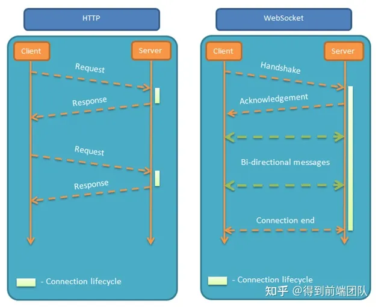

[来源](https://zhuanlan.zhihu.com/p/408291927)
# 一、WebSocket简介
- 什么是WebSocket

   HTML5规范提供的一种浏览器与服务器进行全双工通讯的网络技术，它的最大特点就是，服务器可以主动向客户端推送信息，客户端也可以主动向服务器发送信息，是真正的双向平等对话，属于服务器推送技术的一种。

- 优点

   相对于http协议来说：1.支持双向通信2.使用简单，只需要在浏览器中调用api就能完成协议切换3.支持扩展，可以在协议中实现自定义的子协议4.头部开销小，可以在网络中更快的传输

# 二、WebSocket需要学什么

对于一个网络协议来说，我们首先应该了解它是如何工作的

- 如何建立连接

客户端：申请协议升级

首先，客户端发起http请求升级协议。

WebSocket请求头 
~~~
GET ws://localhost:8080/ws HTTP/1.1
Host: localhost:8080
**Connection: Upgrade //表示要升级协议
Pragma: no-cache
Cache-Control: no-cache
User-Agent: Mozilla/5.0 (Macintosh; Intel Mac OS X 10_15_7) AppleWebKit/537.36 (KHTML, like Gecko) Chrome/92.0.4515.107 Safari/537.36
**Upgrade: websocket   //表示要升级到websocket协议。
Origin: http://localhost:3000
**Sec-WebSocket-Version: 13  //表示websocket的版本
Accept-Encoding: gzip, deflate, br
Accept-Language: zh-CN,zh;q=0.9
**Sec-WebSocket-Key: C7dHJDei+oA4n+deqF1sVQ==  // 浏览器随机生成，与Version配套，提供基本防护
**Sec-WebSocket-Extensions: permessage-deflate; client_max_window_bits
// 此标头字段仅用于 WebSocket 开启握手。
~~~

http请求头部

~~~
POST /api/proxy?info=studylist-all HTTP/1.1
Host: oms.test.igetget.dc
Connection: keep-alive
Content-Length: 132
Accept: application/json, text/plain, */*
X-Requested-With: XMLHttpRequest
User-Agent: Mozilla/5.0 (Macintosh; Intel Mac OS X 10_15_7) AppleWebKit/537.36 (KHTML, like Gecko) Chrome/92.0.4515.107 Safari/537.36
Content-Type: application/json;charset=UTF-8
Origin: http://oms.test.igetget.dc
Referer: http://oms.test.igetget.dc/oms-host
Accept-Encoding: gzip, deflate
Accept-Language: zh-CN,zh;q=0.9
Cookie: //cookie太长就删了
~~~

服务端：响应协议升级

WeSocket响应头

~~~
HTTP/1.1 101 Switching Protocols
Upgrade: websocket
Connection: Upgrade
Sec-WebSocket-Accept: AJ50yH17ZJy90K+0rmqlyIfdsBM=   //根据客户端请求首部的Sec-WebSocket-Key计算出来。
~~~

http响应头

~~~
HTTP/1.1 200 OK
Server: nginx/1.16.1
Date: Wed, 04 Aug 2021 07:09:56 GMT
Content-Type: application/json; charset=utf-8
Transfer-Encoding: chunked
Connection: keep-alive
x-frame-options: SAMEORIGIN
x-xss-protection: 1; mode=block
x-content-type-options: nosniff
x-download-options: noopen
x-readtime: 19
~~~

- 数据帧格式

~~~
  0                   1                   2                   3
  0 1 2 3 4 5 6 7 8 9 0 1 2 3 4 5 6 7 8 9 0 1 2 3 4 5 6 7 8 9 0 1
 +-+-+-+-+-------+-+-------------+-------------------------------+
 |F|R|R|R| opcode|M| Payload len |    Extended payload length    |
 |I|S|S|S|  (4)  |A|     (7)     |             (16/64)           |
 |N|V|V|V|       |S|             |   (if payload len==126/127)   |
 | |1|2|3|       |K|             |                               |
 +-+-+-+-+-------+-+-------------+ - - - - - - - - - - - - - - - +
 |     Extended payload length continued, if payload len == 127  |
 + - - - - - - - - - - - - - - - +-------------------------------+
 |                               |Masking-key, if MASK set to 1  |
 +-------------------------------+-------------------------------+
 | Masking-key (continued)       |          Payload Data         |
 +-------------------------------- - - - - - - - - - - - - - - - +
 :                     Payload Data continued ...                :
 + - - - - - - - - - - - - - - - - - - - - - - - - - - - - - - - +
 |                     Payload Data continued ...                |
 +---------------------------------------------------------------+
~~~

FIN：1个比特。表示是否为最后一个分片

RSV1，2，3：各占1个比特。值必须为0，除非使用了非零含义的扩展，如果服务端收到了非0的值且没有对应的扩展，服务端自动断开连接

Opcode: 4个比特。

操作代码，Opcode的值决定了应该如何解析后续的数据载荷（data payload）。如果操作代码是不认识的，那么接收端应该断开连接（fail the connection）。可选的操作代码如下： 
>0x0：表示一个延续帧。 0x1：表示这是一个文本帧 0x2：表示这是一个二进制帧 0x3-7：保留用于进一步的非控制帧 0x8：表示连接断开。 0x9：表示这是一个ping操作。 0xA：表示这是一个pong操作。 0xB-F：保留用于进一步的控制帧

❗0x3-7和0xB-F都是保留的帧，但一个是非控制帧，一个是控制帧

Mask: 1个比特。

定义是否屏蔽“有效载荷数据”。如果设置为 1， 则在 masking-key 中存在一个掩码键，这用于取消屏蔽“有效负载数据” 。从客户端发送到服务器的所有帧都将此位设置为 1。

Payload length：

有效载荷数据的长度，以字节为单位：如果为 0-125，则为有效载荷长度。如果是 126，则解释为

16 位无符号整数的以下 2 个字节是有效载荷长度。如果为 127，则解释为 64 位无符号整数（最高有效位必须为 0）的以下 8 个字节是有效载荷长度。多字节长度量以网络字节顺序表示。请注意，在所有情况下，必须使用最小字节数来编码长度，例如，124 字节长的字符串的长度不能编码为序列 126, 0, 124。有效载荷长度为“扩展数据”的长度+ “应用数据”的长度。“扩展数据”的长度可以为零，在这种情况下，有效载荷长度是“应用数据”的长度。

Masking-key：0或4字节

所有从客户端传送到服务端的数据帧，数据载荷都进行了掩码操作，Mask为1，且携带了4字节的Masking-key。如果Mask为0，则没有Masking-key。

Payload data：(x+y) 字节

有效载荷数据被定义为与应用数据连接的扩展数据。

扩展数据： 扩展数据为 0 字节，除非扩展已被协商。任何扩展必须指定扩展数据的长度，或如何计算该长度，以及在打开握手期间必须如何协商扩展使用。如果存在，扩展数据包含在总有效载荷长度中。

应用数据：应用数据的长度等于有效载荷长度减去扩展数据的长度。

- 掩码算法

掩码键（Masking-key）是由客户端挑选出来的32位的随机数。掩码操作不会影响数据载荷的长度。掩码、反掩码操作都采用如下算法。

假设：

>original-octet-i：为原始数据的第i字节。 transformed-octet-i：为转换后的数据的第i字节。 j：为i mod 4的结果。 masking-key-octet-j：为mask key第j字节。 

算法描述为：

original-octet-i 与 masking-key-octet-j 异或后，得到 transformed-octet-i。
即：
~~~
 j = i MOD 4 //mod为模运算符，意思跟取余除法类似，j为i除4的余数
 transformed-octet-i = original-octet-i XOR masking-key-octet-j
~~~

~~~
// hello WebSocket
let uint8 = new Uint8Array([
  0x68, 0x65, 0x6c, 0x6f, 0x20, 0x77, 0x65, 0x62, 0x73, 0x6f, 0x63, 0x6b, 0x65,0x74, 0x0a,
])
let maskingKey = new Uint8Array([0x08, 0xf6, 0xef, 0xb1])
let maskedUint8 = new Uint8Array(uint8.length)

for (let i = 0, j = 0; i < uint8.length; i++, j = i % 4) {
     maskedUint8[i] = uint8[i] ^ maskingKey[j]
}
console.log(
  Array.from(maskedUint8)
    .map((num) => Number(num).toString(16))
    .join(" ")
)
// 60 93 83 de 28 81 8a d3 7b 99 8c da 6d 82 e5
~~~

❓ 思考：数据掩码的作用是增强协议的安全性。但数据掩码并不是为了保护数据本身，因为算法本身是公开的，运算也不复杂。那么为什么还要引入数据掩码呢？ 

引入数据掩码是为了防止早期版本的协议中存在的代理缓存污染攻击等问题。 

- 数据传递

1.数据分片

不知道大家是否看过过tcp的报文格式，这里websocket的分片跟tcp有一些类似，就是一份完整的数据，会被分成几段分别发送出去，这就是数据分片。websocket通过FIN来了解是否是最后一个分片，FIN=0，表示这条消息的分片还没接收完还需要等待，FIN=1，表示为最后一个分片，这时我们会把最后一个分片和之前的分片组合在一起形成一条完整的消息。在数据传输的过程中，如果操作码opcode为0x1，表示数据是一段文本（UTF-8）；0x2，表示数据为二进制数据；0x0表示为延续帧 

2.数据分片例子

来源MDN
~~~
Client: FIN=1, opcode=0x1, msg="hello"
Server: (process complete message immediately) Hi.

Client: FIN=0, opcode=0x1, msg="and a"
Server: (listening, new message containing text started)
Client: FIN=0, opcode=0x0, msg="happy new"
Server: (listening, payload concatenated to previous message)
Client: FIN=1, opcode=0x0, msg="year!"
Server: (process complete message) Happy new year to you too!
~~~

在这个例子中，客户端向服务器发送了两条消息，第一条消息在单个帧发送，第二条消息跨三个帧发送。

第一条消息是一条完整的消息，服务器看到FIN=1和opcode=0x1后，就可以对这条消息响应或操作了。

第二条消息，服务器在看到FIN=0和opcode=0x1后，知道这条文本消息还没发完，继续等待，直到收到FIN=1的分片后，将他们组合在一起，然后再对这条消息响应或操作。 

- 如何维持连接

在上面的操作码中有两个特殊的操作码，ping帧和pong帧，这两个操作码组合在一起来保证连接没有断开。

客户端可以在建立连接后和断开连接前随时发送ping帧，服务端在收到ping帧后要立即响应pong帧。

如果服务端收到了ping帧，但还没来得及响应之前的ping帧，这时候服务端可以响应最近的ping帧。

> ping 帧既可以作为保持连接的一种手段，也可以验证远程端点是否仍然响应 

❓ 思考：WebSocket是双向通信，那么服务端是否可以单独发送pong帧呢 

A Pong frame may be sent unsolicited. This serves as a unidirectional heartbeat. A response to an unsolicited Pong frame is not expected.

- 如何关闭连接

关闭连接的过程跟tcp也有一些相似，不过它不需要4次挥手，只需要挥一次手就够了 。WebSocket 连接的关闭可以由任一端点发起，也可能同时发起，只需要发送一个关闭帧即可

❓ 思考：什么情况下会拒绝断开连接呢 

假设在网络中还有一个数据分片没送到其中一个端点手里，而关闭帧先于数据帧到，此时这个断点不会立刻断开连接，而是会等到数据都收到后再断开连接，关闭帧端点只会发送一次，不会发送更多关闭帧。

断开连接还包括异常关闭，具体请查看RFC6455规范。 

# WebSocket例子

聊天室

index.js 

~~~
const app = require("express")()
const server = require("http").Server(app)
const WebSocket = require("ws")
const MyWs = new WebSocket.Server({ port: 8080 })

MyWs.on("open", () => {
  console.log("connected")
})

MyWs.on("close", () => {
  console.log("disconnected")
})

MyWs.on("connection", (ws, req) => {
  const port = req.connection.remotePort
  const clientName = port
  console.log(`${clientName} is connected`)
  // 发送欢迎信息给客户端
  ws.send("Welcome :" + clientName + "加入聊天室")

  ws.on("message", (message) => {
    // 广播消息给所有客户端
    MyWs.clients.forEach((client) => {
      if (client.readyState === WebSocket.OPEN) {
        client.send(clientName + " -> " + message)
      }
    })
  })
})
app.get("/", (req, res) => {
  res.sendfile(__dirname + "/index.html")
})

app.listen(3000)
~~~

index.html

~~~
<!DOCTYPE html>
<html>
  <head>
    <meta charset="UTF-8" />
    <title>WebSocket DEMO</title>
  </head>
  <body>
    
    <form onsubmit="return false;">
      <h3>WebSocket 聊天室：</h3>
      <textarea
        id="responseText"
        style="width: 500px; height: 300px"
      ></textarea>
       
      <input
        type="text"
        name="message"
        style="width: 300px"
        value="Hello"
      />
      <input
        type="button"
        value="发送消息"
        onclick="send(this.form.message.value)"
      />
      <input
        type="button"
        onclick="javascript:document.getElementById('responseText').value=''"
        value="清空聊天记录"
      />
    </form>
  </body>
</html>
~~~

# 结尾小语

在这个文章中简单的介绍了一下WebSocket协议的建立连接的过程，数据帧的格式，数据传递的过程，以及如何维持连接和关闭连接，更详细的过程可以看websocket规范协议全文，websocket可介绍的还有很多，像websocket扩展、websocket安全等等，大家都可以在下面的链接中找到答案。

说一点个人的理解，从websocket协议出来到现在已经10年了，但是感觉使用的话还不是很普及，个人感觉还是跟使用场景有关系，长连接会一直占用服务器资源，这可能会造成一定的资源浪费，对于websocket的使用还需要时间来验证，如果介绍的有问题欢迎大家指正。 